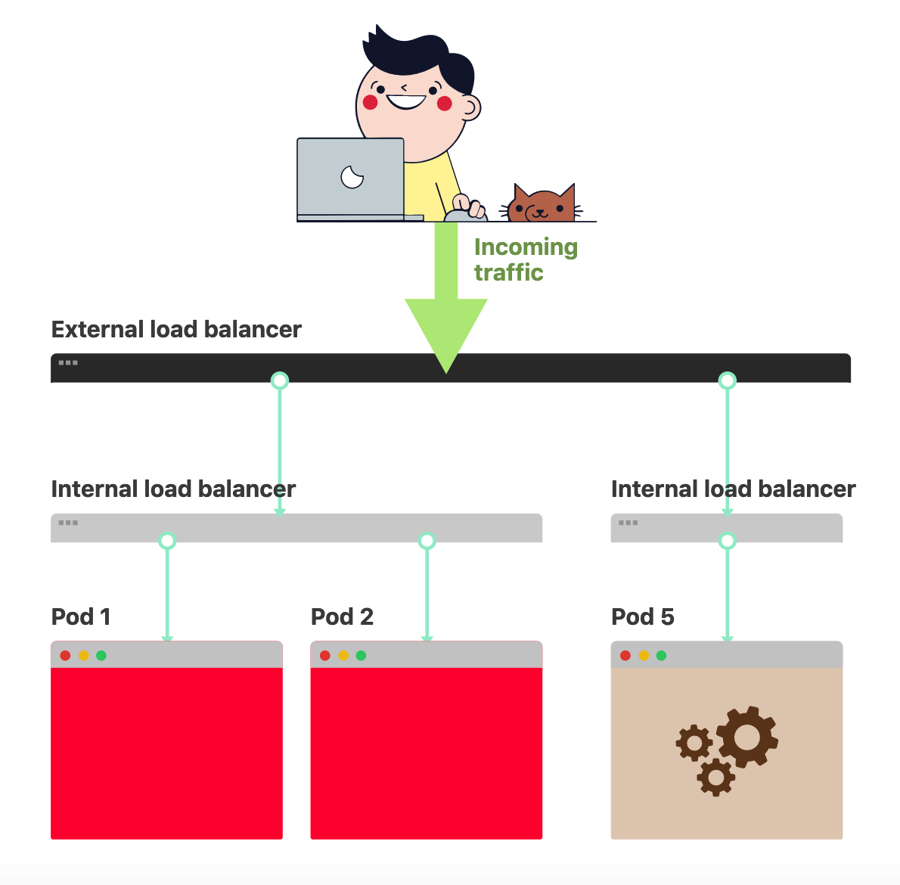
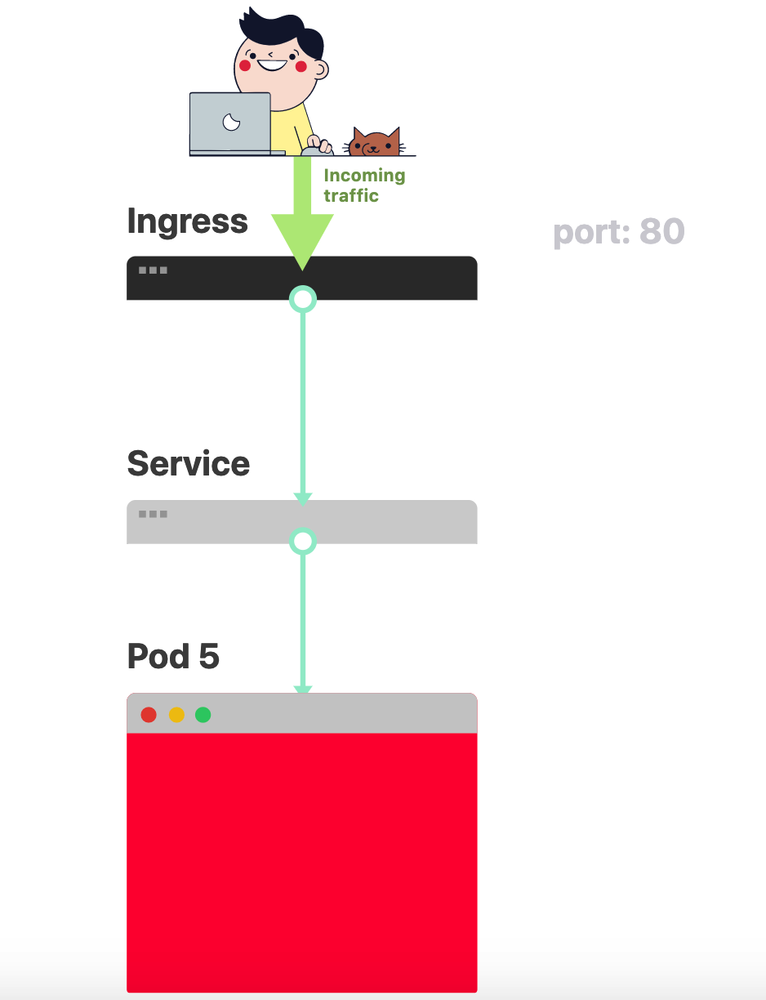
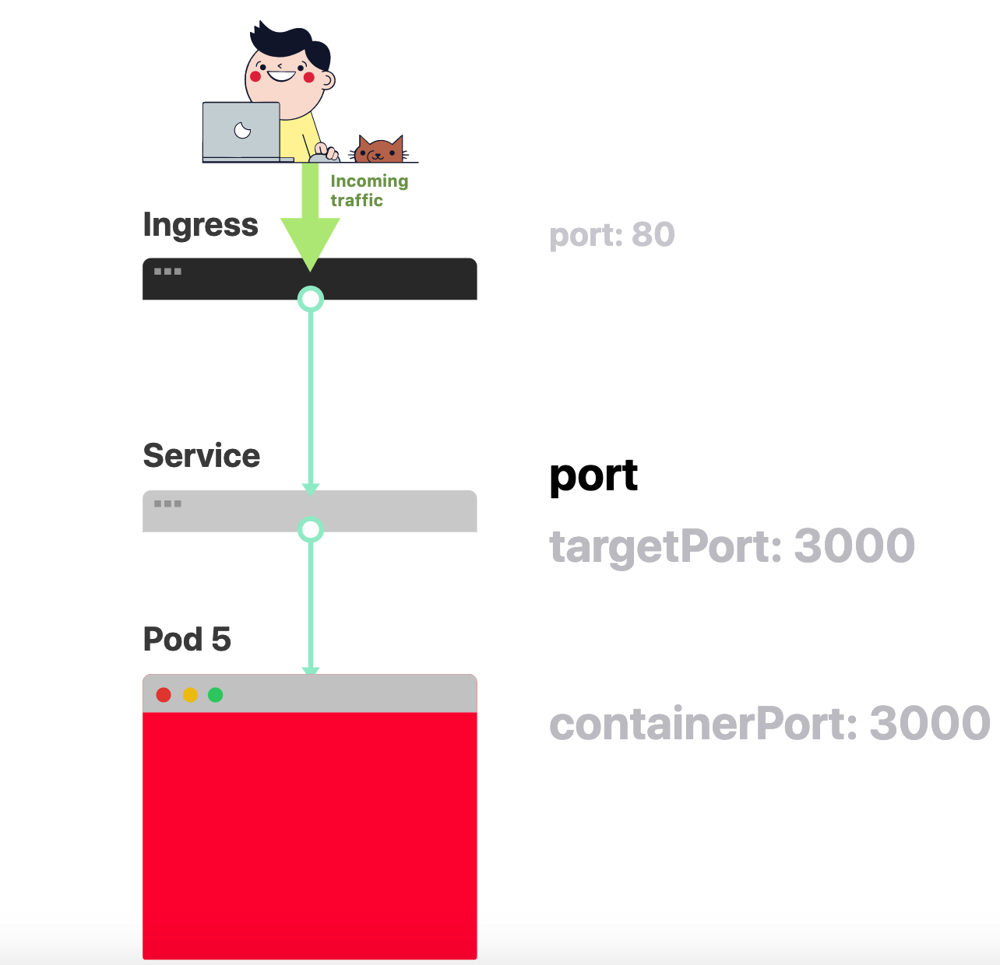

### kubernetes-application

kubernetes 命令集合

1. 用来显示当前的各种用户进程限制

```bash
> ulimit -a

core file size          (blocks, -c) 0
data seg size           (kbytes, -d) unlimited
scheduling priority             (-e) 0
file size               (blocks, -f) unlimited
pending signals                 (-i) 63459
max locked memory       (kbytes, -l) 8589934592
max memory size         (kbytes, -m) unlimited
open files                      (-n) 655360
pipe size            (512 bytes, -p) 8
POSIX message queues     (bytes, -q) 819200
real-time priority              (-r) 0
stack size              (kbytes, -s) 8192
cpu time               (seconds, -t) unlimited
max user processes              (-u) 4096
virtual memory          (kbytes, -v) unlimited
file locks                      (-x) unlimited
```

2. 更新test-service服务
```bash
> kubectl apply -f test-service.yml
```

3. 获取在kube-system空间上运行的pod和service
```bash
> kubectl get pod,svc -n kube-system
```

4. 获取所有命名空间上的pods
```bash
> kubectl get pods --all-namespaces
```

5. 根据metadata列表服务按名称排序
```bash
> kubectl get pods --sort-by=.metadata.name
```

6. 列出所有namespace中的所有 service
```bash
>  kubectl get services  --all-namespaces 
 
NAMESPACE     NAME                   TYPE        CLUSTER-IP       EXTERNAL-IP                                       PORT(S)                  AGE
default       heapster               ClusterIP   10.98.124.49     <none>                                            80/TCP                   27h
default       kubernetes             ClusterIP   10.96.0.1        <none>                                            443/TCP                  111d
default       monitoring-grafana     ClusterIP   10.103.85.89     <none>                                            80/TCP                   22h
kube-system   heapster               ClusterIP   10.103.46.91     <none>                                            80/TCP                   29h
kube-system   kube-dns               ClusterIP   10.96.0.10       <none>                                            53/UDP,53/TCP,9153/TCP   111d
kube-system   kubelet                ClusterIP   None             <none>                                            10250/TCP                106d
kube-system   kubernetes-dashboard   NodePort    10.102.72.242    192.168.132.190,192.168.132.193,192.132.132.194   443:32631/TCP            105d
kube-system   metrics-server         ClusterIP   10.98.249.8      <none>                                            443/TCP                  106d
kube-system   monitoring-grafana     ClusterIP   10.102.205.153   <none>                                            80/TCP                   29h
kube-system   monitoring-influxdb    ClusterIP   10.97.131.84     <none>                                            8086/TCP                 29h                       
```

7. 使用详细输出来描述pods heapster
```bash
> kubectl describe pods heapster-646cd5db76-95wpz
```

8. 获取api的各个版本
```bash
> kubectl api-versions
```

9. 获取所有命名空间上部署的pods
```bash
> kubectl get deployment --all-namespaces
```

10. 获取kube-system命名空间上部署的pods
```bash
>  kubectl get deployment -n kube-system
```

11. 获取所有节点
```bash
> kubectl get nodes
```

12. 获取所有命名空间命名空间上部署的services
```bash
> kubectl get services --all-namespaces
```

13. 获取kube-system命名空间上部署的services
```bash
> kubectl get services -n kube-system
```

14. 获取kubeadm的版本
```bash
>  kubeadm version --output json
```

15. 编辑名为 docker-registry 的 service
```bash
> kubectl edit svc/docker-registry   
```

16. 与运行中的 Pod 交互
```bash
> kubectl logs my-pod                                 # dump 输出 pod 的日志（stdout）
> kubectl logs my-pod -c my-container                 # dump 输出 pod 中容器的日志（stdout，pod 中有多个容器的情况下使用）
> kubectl logs -f my-pod                              # 流式输出 pod 的日志（stdout）
> kubectl logs -f my-pod -c my-container              # 流式输出 pod 中容器的日志（stdout，pod 中有多个容器的情况下使用）
> kubectl run -i --tty busybox --image=busybox -- sh  # 交互式 shell 的方式运行 pod
> kubectl attach my-pod -i                            # 连接到运行中的容器
> kubectl port-forward my-pod 5000:6000               # 转发 pod 中的 6000 端口到本地的 5000 端口
> kubectl exec my-pod -- ls /                         # 在已存在的容器中执行命令（只有一个容器的情况下）
> kubectl exec my-pod -c my-container -- ls /         # 在已存在的容器中执行命令（pod 中有多个容器的情况下）
> kubectl top pod POD_NAME --containers               # 显示指定 pod 和容器的指标度量
```

17. 在编辑器中编辑任何 API 资源
```bash
> kubectl edit svc/docker-registry                      # 编辑名为 docker-registry 的 service
> KUBE_EDITOR="nano" kubectl edit svc/docker-registry   # 使用其它编辑器
```

18. 更新资源
```bash
> kubectl rolling-update frontend-v1 -f frontend-v2.json           # 滚动更新 pod frontend-v1
> kubectl rolling-update frontend-v1 frontend-v2 --image=image:v2  # 更新资源名称并更新镜像
> kubectl rolling-update frontend --image=image:v2                 # 更新 frontend pod 中的镜像
> kubectl rolling-update frontend-v1 frontend-v2 --rollback        # 退出已存在的进行中的滚动更新
> cat pod.json | kubectl replace -f -                              # 基于 stdin 输入的 JSON 替换 pod

# 强制替换，删除后重新创建资源。会导致服务中断。
> kubectl replace --force -f ./pod.json

# 为 nginx RC 创建服务，启用本地 80 端口连接到容器上的 8000 端口
> kubectl expose rc nginx --port=80 --target-port=8000

# 更新单容器 pod 的镜像版本（tag）到 v4
> kubectl get pod mypod -o yaml | sed 's/\(image: myimage\):.*$/\1:v4/' | kubectl replace -f -

> kubectl label pods my-pod new-label=awesome                      # 添加标签
> kubectl annotate pods my-pod icon-url=http://goo.gl/XXBTWq       # 添加注解
> kubectl autoscale deployment foo --min=2 --max=10                # 自动扩展 deployment “foo”
```

19. 显示和查找资源
```bash
> kubectl get services                          # 列出所有 namespace 中的所有 service
> kubectl get pods --all-namespaces             # 列出所有 namespace 中的所有 pod
> kubectl get pods -o wide                      # 列出所有 pod 并显示详细信息
> kubectl get deployment my-dep                 # 列出指定 deployment
> kubectl get pods --include-uninitialized      # 列出该 namespace 中的所有 pod 包括未初始化的

# 使用详细输出来描述命令
> kubectl describe nodes my-node
> kubectl describe pods my-pod

> kubectl get services --sort-by=.metadata.name # List Services Sorted by Name

# 根据重启次数排序列出 pod
> kubectl get pods --sort-by='.status.containerStatuses[0].restartCount'

# 获取所有具有 app=cassandra 的 pod 中的 version 标签
> kubectl get pods --selector=app=cassandra rc -o \
  jsonpath='{.items[*].metadata.labels.version}'

# 获取所有节点的 ExternalIP
> kubectl get nodes -o jsonpath='{.items[*].status.addresses[?(@.type=="ExternalIP")].address}'

# 列出属于某个 PC 的 Pod 的名字
# “jq”命令用于转换复杂的 jsonpath，参考 https://stedolan.github.io/jq/
> sel=${$(kubectl get rc my-rc --output=json | jq -j '.spec.selector | to_entries | .[] | "\(.key)=\(.value),"')%?}
> echo $(kubectl get pods --selector=$sel --output=jsonpath={.items..metadata.name})

# 查看哪些节点已就绪
> JSONPATH='{range .items[*]}{@.metadata.name}:{range @.status.conditions[*]}{@.type}={@.status};{end}{end}' \
 && kubectl get nodes -o jsonpath="$JSONPATH" | grep "Ready=True"

# 列出当前 Pod 中使用的 Secret
> kubectl get pods -o json | jq '.items[].spec.containers[].env[]?.valueFrom.secretKeyRef.name' | grep -v null | sort | uniq
```

20. 修补资源,使用策略合并补丁并修补资源。
```bash
> kubectl patch node k8s-node-1 -p '{"spec":{"unschedulable":true}}' # 部分更新节点

# 更新容器镜像； spec.containers[*].name 是必须的，因为这是合并的关键字
> kubectl patch pod valid-pod -p '{"spec":{"containers":[{"name":"kubernetes-serve-hostname","image":"new image"}]}}'

# 使用具有位置数组的 json 补丁更新容器镜像
> kubectl patch pod valid-pod --type='json' -p='[{"op": "replace", "path": "/spec/containers/0/image", "value":"new image"}]'

# 使用具有位置数组的 json 补丁禁用 deployment 的 livenessProbe
> kubectl patch deployment valid-deployment  --type json   -p='[{"op": "remove", "path": "/spec/template/spec/containers/0/livenessProbe"}]'
```


21. Scale 资源
```bash
> kubectl scale --replicas=3 rs/foo                                 # Scale a replicaset named 'foo' to 3
> kubectl scale --replicas=3 -f foo.yaml                            # Scale a resource specified in "foo.yaml" to 3
> kubectl scale --current-replicas=2 --replicas=3 deployment/mysql  # If the deployment named mysql's current size is 2, scale mysql to 3
> kubectl scale --replicas=5 rc/foo rc/bar rc/baz                   # Scale multiple replication controllers
```

22. 删除资源
```bash
> kubectl delete -f ./pod.json                                              # 删除 pod.json 文件中定义的类型和名称的 pod
> kubectl delete pod,service baz foo                                        # 删除名为“baz”的 pod 和名为“foo”的 service
> kubectl delete pods,services -l name=myLabel                              # 删除具有 name=myLabel 标签的 pod 和 serivce
> kubectl delete pods,services -l name=myLabel --include-uninitialized      # 删除具有 name=myLabel 标签的 pod 和 service，包括尚未初始化的
> kubectl -n my-ns delete po,svc --all                                      # 删除 my-ns namespace 下的所有 pod 和 serivce，包括尚未初始化的
```

24. 创建对象
```bash
> kubectl create -f ./my-manifest.yaml           # 创建资源
> kubectl create -f ./my1.yaml -f ./my2.yaml     # 使用多个文件创建资源
> kubectl create -f ./dir                        # 使用目录下的所有清单文件来创建资源
> kubectl create -f https://git.io/vPieo         # 使用 url 来创建资源
> kubectl run nginx --image=nginx                # 启动一个 nginx 实例
> kubectl explain pods,svc                       # 获取 pod 和 svc 的文档

# 从 stdin 输入中创建多个 YAML 对象
> cat <<EOF | kubectl create -f -
apiVersion: v1
kind: Pod
metadata:
  name: busybox-sleep
spec:
  containers:
  - name: busybox
    image: busybox
    args:
    - sleep
    - "1000000"
---
apiVersion: v1
kind: Pod
metadata:
  name: busybox-sleep-less
spec:
  containers:
  - name: busybox
    image: busybox
    args:
    - sleep
    - "1000"
EOF

# 创建包含几个 key 的 Secret
> cat <<EOF | kubectl create -f -
apiVersion: v1
kind: Secret
metadata:
  name: mysecret
type: Opaque
data:
  password: $(echo "s33msi4" | base64)
  username: $(echo "jane" | base64)
EOF
```

#### Kubernetes Deployment 故障排查常见方法


<p align="center">

</p>

当你希望在 Kubernetes 中部署应用程序时，你通常会定义三个组件：

* Deployment – 用于创建你的应用程序的 Pod 副本的清单；
* Service – 一个内部负载均衡器，用于将流量路由到内部的 Pod 上；
* Ingress – 描述流量如何从集群外部流入到集群内部的服务上。

<p align="center">

</p>

```markdown

在 Kubernetes 中，你的应用程序通过两层负载均衡器暴露服务：内部的和外部的。
```

假设你要部署一个简单的 “HelloWorld” 应用，该应用的 YAML 文件的内容应该类似下面这样：

```yaml
apiVersion: apps/v1
kind: Deployment
metadata:
  name: my-deployment
  labels:
    track: canary
spec:
  selector:
    matchLabels:
      any-name: my-app
  template:
    metadata:
      labels:
        any-name: my-app
    spec:
      containers:
      - name: cont1
        image: learnk8s/app:1.0.0
        ports:
        - containerPort: 8080
---
apiVersion: v1
kind: Service
metadata:
  name: my-service
spec:
  ports:
  - port: 80
    targetPort: 8080
  selector:
    name: app
---
apiVersion: networking.k8s.io/v1beta1
kind: Ingress
metadata:
  name: my-ingress
spec:
  rules:
  - http:
    paths:
    - backend:
        serviceName: app
        servicePort: 80
      path: /
```

这个定义很长，组件之间的相互关系并不容易看出来。例如：

* 什么时候应使用 80 端口，又是何时应使用 8080 端口？
* 你是否应该为每个服务创建一个新端口以免它们相互冲突？
* 标签(label)名重要吗？它们是否在每个地方都应该是一样的？

在进行调试之前，让我们回顾一下这三个组件是如何相互关联的。让我们先从 Deployment 和 Service 开始。

#### 连接 Deployment 和 Service

值得注意的是，Service 和 Deployment 之间其实根本没有连接。事实是：Service 直接指向 Pod，并完全跳过了Deployment。


所以，你应该注意的是 Pod 和 Service 之间的相互关系。你应该记住三件事：

* Service selector 应至少与 Pod 的一个标签匹配；
* Service 的 targetPort 应与 Pod 中容器的 containerPort 匹配；
* Service 的 port 可以是任何数字。多个 Service 可以使用同一端口号，因为它们被分配了不同的 VIP 地址。

下面的图总结了如何连接端口：

<p align="center">

</p>

考虑上面服务暴露的 Pod 端口, 仔细再看看 YAML 文件，Label 标签和 ports/targetPort 应该匹配：

```yaml

apiVersion: apps/v1
kind: Deployment
metadata:
  name: my-deployment
  labels:
    track: canary
spec:
  selector:
    matchLabels:
      any-name: my-app
  template:
    metadata:
      labels:
        any-name: my-app
    spec:
      containers:
      - name: cont1
        image: learnk8s/app:1.0.0
        ports:
        - containerPort: 8080
---
apiVersion: v1
kind: Service
metadata:
  name: my-service
spec:
  ports:
  - port: 80
    targetPort: 8080
  selector:
    any-name: my-app
```

那 Deployment 顶部的 track: canary 标签呢？它也应该匹配吗？该标签属于 Deployment，Service 的选择器不会使用它来路由请求。
换句话说，你可以安全地删除它或为其分配其他值。

那 matchLabels 选择器呢？它必须始终与 Pod 的标签匹配，并且被 Deployment 用来跟踪 Pod。

假设你已经进行了所有正确的设置，该如何测试它呢？你可以使用以下命令检查 Pod 是否具有正确的标签：

```bash
> kubectl get pods --show-labels
```

或者，如果你有属于多个应用程序的 Pod：

```bash
> kubectl get pods --selector any-name=my-app --show-labels
```

其中 any-name=my-app 就是标签：any-name: my-app。

你还可以使用 kubectl 中的 port-forward 命令连接到 service 并测试连接。

```bash
> kubectl port-forward service/<service name> 3000:80
```

* `service/<service name>` 是服务的名称- 在上面的 YAML 中是“my-service”.
* 3000 是你希望在节点上打开的端口.
* 80 是 service 通过 port 字段暴露的端口.

如果可以连接，则说明设置正确。如果不行，则很可能是你填写了错误的标签或端口不匹配。


#### 连接 Service 和 Ingress

接下来是配置 Ingress 以将你的应用暴露到集群外部。Ingress 必须知道如何检索服务，然后检索 Pod 并将流量路由给它们。

Ingress 按名字和暴露的端口检索正确的服务。在 Ingress 和 Service 中应该匹配两件事：

* Ingress 的 servicePort 应该匹配 service 的 port；
* Ingress 的 serviceName 应该匹配 service 的 name。

<p align="center">

</p>

```markdown
我们已经知道 Servive 暴露一个 port。
```

在实践过程中，我们应该可以看到如下所示的资源清单文件（下面代码中的 my-service 和 80）：

```yaml
apiVersion: v1
kind: Service
metadata:
  name: my-service
spec:
  ports:
  - port: 80
    targetPort: 8080
  selector:
    any-name: my-app
---
apiVersion: networking.k8s.io/v1beta1
kind: Ingress
metadata:
  name: my-ingress
spec:
  rules:
  - http:
    paths:
    - backend:
        serviceName: my-service
        servicePort: 80
      path: /

```

那么我们应该如何测试 Ingress 是否正常工作呢？你可以使用与以前相同的策略kubectl port-forward，但是这次你应该连接到 Ingress 控制器，而不是连接到 Service。

首先，使用以下命令检索 Ingress 控制器的 Pod 名称：
```bash
> kubectl get pods --all-namespaces
NAMESPACE   NAME                              READY STATUS
kube-system coredns-5644d7b6d9-jn7cq          1/1   Running
kube-system etcd-minikube                     1/1   Running
kube-system kube-apiserver-minikube           1/1   Running
kube-system kube-controller-manager-minikube  1/1   Running
kube-system kube-proxy-zvf2h                  1/1   Running
kube-system kube-scheduler-minikube           1/1   Running
kube-system nginx-ingress-controller-6fc5bcc  1/1   Running
```

标识 Ingress Pod（可能在其他命名空间中）并描述它以获取端口：
```bash
> kubectl describe pod nginx-ingress-controller-6fc5bcc \
   --namespace kube-system \
   | grep Ports
  Ports:         80/TCP, 443/TCP, 18080/TCP
```

最后，连接到该 Pod 上：
```bash
> kubectl port-forward nginx-ingress-controller-6fc5bcc 3000:80 --namespace kube-system
```

现在每次你访问计算机上的 3000 端口时，请求都会转发到 Ingress 控制器 Pod 上的 80 端口。如果访问http://localhost:3000，则应可以访问到提供网页服务的应用程序。

#### 端口回顾

现在我们来快速回顾一下哪些端口和标签应该匹配：

* Service selector 应与 Pod 的标签匹配.
* Service 的 targetPort 应与 Pod 中容器的 containerPort 匹配.
* Service 的端口可以是任何数字。多个服务可以使用同一端口，因为它们分配了不同的 IP 地址.
* Ingress 的 servicePort 应该匹配 Service 的 port.
* Serivce 的名称应与 Ingress 中的 serviceName 字段匹配.

知道了如何定义 YAML 资源清单文件这只是我们故事的一部分。出了问题后该怎么办？Pod 可能无法启动，或者正在崩溃。接下来给大家介绍几种常见的故障排查方法。

#### 故障排查3步骤

在深入研究失败的 Deployment 之前，我们必须对 Kubernetes 的工作原理有一个明确定义的模型。由于每个Deployment 中都有三个组件，因此你应该自下而上依次调试所有组件。

* 你应该先确保 Pods 正在运行.
* 然后，专注于让 Service 将流量路由到正确的 Pod.
* 然后，检查是否正确配置了 Ingress.

```markdown

你应该从底部开始对 Deployment 进行故障排除。首先，检查 Pod 是否已就绪并正在运行。
```

1. Pod 故障排查

在大多数情况下，问题出在 Pod 本身。你应该确保 Pod 正在运行并准备就绪。该如何检查呢？
```bash
> kubectl get pods
NAME                    READY STATUS            RESTARTS  AGE
app1                    0/1   ImagePullBackOff  0         47h
app2                    0/1   Error             0         47h
app3-76f9fcd46b-xbv4k   1/1   Running           1         47h
```

在上述会话中，最后一个 Pod 处于就绪并正常运行的状态；但是，前两个 Pod 既不处于 Running 也不是 Ready。

你应该如何查看出了什么问题呢？有四个有用的命令可以对 Pod 进行故障排除：

* kubectl logs 有助于检索 Pod 容器的日志.

* kubectl describe pod 检索与 Pod 相关的事件列表很有用.

* kubectl get pod 用于提取存储在 Kubernetes 中的 Pod 的 YAML 定义.

* kubectl exec -it bash 在 Pod 的一个容器中运行交互式命令很有用.


常见 Pod 错误

Pod 可能会出现启动和运行时错误。启动错误包括：

* ImagePullBackoff
* ImageInspectError
* ErrImagePull
* ErrImageNeverPull
* RegistryUnavailable
* InvalidImageName


运行时错误包括：

* CrashLoopBackOff
* RunContainerError
* KillContainerError
* VerifyNonRootError
* RunInitContainerError
* CreatePodSandboxError
* ConfigPodSandboxError
* KillPodSandboxError
* SetupNetworkError
* TeardownNetworkError

有些错误比其他错误更常见。以下是最常见的错误列表以及如何修复它们的方法。


##### ImagePullBackOff

当 Kubernetes 无法获取到 Pod 中某个容器的镜像时，将出现此错误。共有三个可能的原因：

* 镜像名称无效-例如，你拼错了名称，或者镜像不存在
* 你为镜像指定了不存在的标签
* 你尝试检索的镜像属于一个私有 registry，而 Kubernetes 没有凭据可以访问它

前两种情况可以通过修改镜像名称和标记来解决。针对第三种情况，你应该将私有 registry 的访问凭证通过 Secret添加到 Kubernetes 中并在 Pod 中引用它。

官方文档中有一个[有关如何实现此目标的示例](https://kubernetes.io/docs/tasks/configure-pod-container/pull-image-private-registry/)。

##### CrashLoopBackOff

如果容器无法启动，则 Kubernetes 将显示错误状态为：`CrashLoopBackOff`。

通常，在以下情况下容器无法启动：

* 应用程序中存在错误，导致无法启动.
* 你未正确配置容器.
* Liveness 探针失败太多次.

你应该尝试从该容器中检索日志以调查其失败的原因。如果由于容器重新启动太快而看不到日志，则可以使用以下命令：

```bash
> kubectl logs <pod-name> --previous
```

这个命令可以打印前一个容器的错误日志信息。

##### RunContainerError

当容器无法启动时，会出现此错误。甚至在容器内的应用程序启动之前。该问题通常是由于配置错误，例如：

* 挂载不存在的卷，例如 ConfigMap 或 Secrets
* 将只读卷挂载为可读写
* 你应该使用kubectl describe pod命令收集和分析错误

##### Pending 状态的 Pod

当创建 Pod 时，该 Pod 处于 Pending 状态。为什么？假设你的调度程序组件运行良好，可能的原因如下：

* 集群没有足够的资源（例如CPU和内存）来运行 Pod.
* 当前的命名空间具有 ResourceQuota 对象，创建 Pod 将使命名空间超过配额.
* 该 Pod 绑定到一个处于 pending 状态的 PersistentVolumeClaim.

最好的选择是检查kubectl describe命令输出的“事件”部分内容：

```bash
> kubectl describe pod <pod name>
```

对于因 ResourceQuotas 而导致的错误，可以使用以下方法检查集群的日志：
```bash
> kubectl get events --sort-by=.metadata.creationTimestamp
```

##### 未就绪状态的 Pod

如果 Pod 正在运行但未就绪(not ready)，则表示 readiness 就绪探针失败。当“就绪”探针失败时，Pod 未连接到服务，并且没有流量转发到该实例。

就绪探针失败是应用程序的特定错误，因此你应检查kubectl describe中的“事件”部分以识别错误。

2. Service 故障排查

如果你的 Pod 正在运行并处于就绪状态，但仍无法收到应用程序的响应，则应检查服务的配置是否正确。

Service 旨在根据标签将流量路由到对应的 Pod。因此，你应该检查的第一件事是服务关联了多少个 Pod。

你可以通过检查服务中的端点(endpoint)来做到这一点：

```go
> kubectl describe service <service-name> | grep Endpoints
```

端点是一个集合，并且在服务以 Pod 为目标时，应该至少有一个端点。如果“端点”部分为空，则有两种解释：

* 你没有运行带有正确标签的 Pod（应检查自己是否在正确的命名空间中）
* Service 的 selector 标签上有错字

如果你看到端点列表，但仍然无法访问你的应用程序，则 targetPort 很有可能不匹配导致的。那我们应该如何测试 Service 呢？

无论服务类型如何，你都可以使用kubectl port-forward来连接它：
```bash
>  kubectl port-forward service/<service-name> 3000:80
```

3. Ingress 的故障排查

如果你已经排查到这一步了的话，则：

* Pod 正在运行并准备就绪.
* Serivce 会将流量分配到 Pod.

但是你仍然看不到应用程序的响应。这意味着最有可能是 Ingress 配置错误。由于正在使用的 Ingress 控制器是集群中的第三方组件，因此有不同的调试技术，具体取决于 Ingress 控制器的类型。

但是在深入研究 Ingress 专用工具之前，你可以用一些简单的方法进行检查。

Ingress 使用 serviceName 和 servicePort 连接到 Service。你应该检查这些配置是否正确。你可以通过下面命令检查 Ingress 配置是否正确：

```bash
> kubectl describe ingress <ingress-name>
```

如果 backend 一列为空，则配置中必然有一个错误。如果你可以在“backend”列中看到端点，但是仍然无法访问该应用程序，则可能是以下问题：

* 你如何将 Ingress 暴露于公网的.
* 你如何将集群暴露于公网的.


你还可以通过直接连接到 Ingress Pod 来将基础问题与 Ingress 隔离开。首先，获取你的 Ingress 控制器 Pod（可以位于其他名称空间中）：

```bash
> kubectl get pods --all-namespaces
NAMESPACE   NAME                              READY STATUS
kube-system coredns-5644d7b6d9-jn7cq          1/1   Running
kube-system etcd-minikube                     1/1   Running
kube-system kube-apiserver-minikube           1/1   Running
kube-system kube-controller-manager-minikube  1/1   Running
kube-system kube-proxy-zvf2h                  1/1   Running
kube-system kube-scheduler-minikube           1/1   Running
kube-system nginx-ingress-controller-6fc5bcc  1/1   Running
```

然后描述它以获取 Ingress 控制器 Pod 的端口：
```bash
> kubectl describe pod nginx-ingress-controller-6fc5bcc
   --namespace kube-system \
   | grep Ports
```

最后，连接到 Pod：
```bash
> kubectl port-forward nginx-ingress-controller-6fc5bcc 3000:80 --namespace kube-system
```

此时，每次你访问计算机上的端口 3000 时，请求都会转发到 Pod 上的端口 80。现在可以用吗？

如果可行，则问题出在基础架构中，你应该调查流量如何路由到你的集群。
如果不起作用，则问题出在 Ingress 控制器中，你应该调试 Ingress。
如果仍然无法使 Ingress 控制器正常工作，则应开始对其进行调试。目前有许多不同版本的 Ingress 控制器。热门选项包括 Nginx，HAProxy，Traefik 等，你应该查阅 Ingress 控制器的文档以查找故障排除指南。

由于 [Ingress Nginx](https://github.com/kubernetes/ingress-nginx) 是最受欢迎的 Ingress 控制器，因此接下来我们将介绍一些有关调试 ingress-nginx 的技巧。


#### 调试 Ingress Nginx

Ingress-nginx 项目有一个 Kubectl 的[官方插件](https://kubernetes.github.io/ingress-nginx/kubectl-plugin/)。

你可以使用 `kubectl ingress-nginx` ：

* 检查日志，后端，证书等。
* 连接到 ingress
* 检查当前配置

你应该尝试的三个命令是：

* `kubectl ingress-nginx lint`，它会检查 `nginx.conf` 配置
* `kubectl ingress-nginx backend`，它会检查后端（类似于`kubectl describe ingress`）
* `kubectl ingress-nginx logs`，查看日志
请注意，你可能需要为 Ingress 控制器指定正确的名称空间 `namespace`。


#### 总结

如果你不知道从哪里开始，那么在 Kubernetes 中进行故障排查可能是一项艰巨的任务。你应该始终牢记从下至上解决问题：从 Pod 开始，然后通过 Service 和 Ingress 向上移动排查。

你在本文中了解到的调试技术也可以应用于其他对象，例如：

* failing Job 和 CronJob
* StatefulSets 和 DaemonSets


#### 参考资料

* [A visual guide on troubleshooting Kubernetes deployments](https://learnk8s.io/troubleshooting-deployments)